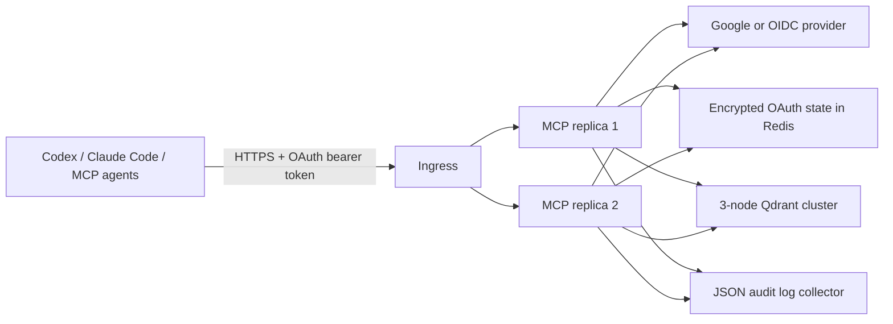

# Secure remote deployment

This fork turns the upstream Qdrant MCP server into an authenticated remote memory
service. The recommended production topology is:



## Why this design

The MCP authorization specification requires protected-resource discovery,
authorization-server metadata, audience-bound tokens, HTTPS, and OAuth authorization
code with PKCE. FastMCP's OAuth/OIDC proxy provides those MCP-facing endpoints while
bridging an identity provider that does not implement MCP Dynamic Client Registration.
It issues a separate MCP audience-bound token rather than passing an upstream token
through to Qdrant.

This follows the same broad pattern as `mdview`—browser authorization, PKCE, client
registration, short access tokens, and refresh handling—but avoids maintaining a
second handwritten authorization server in this repository.

The current sibling `nado/iam` implementation was inspected during this change. It
publishes JWKS and application JWTs, but it is not currently a complete MCP-compatible
OAuth authorization server: standard authorization/token discovery, PKCE/DCR, and
`iss`/`aud`/`scope` token semantics are missing. Do not point `AUTH_MODE=jwt` at it yet.
Either use Google/general OIDC now, or enhance IAM to meet the MCP OAuth contract before
selecting JWT mode.

## Authentication modes

### Google (recommended for the current environment)

Register one Google web OAuth application. Its redirect URI must exactly be:

```text
https://memory.example.com/auth/callback
```

Generate two independent random secrets:

```bash
python -c 'import secrets; print(secrets.token_urlsafe(48))'
python -c 'import secrets; print(secrets.token_urlsafe(48))'
```

Set the first as `AUTH_JWT_SIGNING_KEY` and the second as
`AUTH_STORAGE_ENCRYPTION_KEY`. Store both, the Google client secret, Qdrant API key,
and Redis credentials in the platform secret manager—not a ConfigMap or Git.

Required settings:

```dotenv
AUTH_MODE=google
AUTH_BASE_URL=https://memory.example.com
AUTH_CLIENT_ID=...
AUTH_CLIENT_SECRET=...
AUTH_JWT_SIGNING_KEY=...
AUTH_ALLOWED_EMAILS=owner@example.com
AUTH_STATE_REDIS_URL=rediss://redis.internal:6379/0
AUTH_STORAGE_ENCRYPTION_KEY=...
```

`AUTH_ALLOWED_EMAILS` and `AUTH_ALLOWED_DOMAINS` only authorize verified email claims.
For service identities or an OIDC issuer without `email_verified`, use the immutable
`AUTH_ALLOWED_SUBJECTS` claim instead. With no allowlist the process refuses to start;
`AUTH_ALLOW_ANY_USER=true` is a deliberate, visible opt-out.

### Generic OIDC

Use this for Auth0, Keycloak, Azure, or another standards-compliant OIDC issuer:

```dotenv
AUTH_MODE=oidc
AUTH_BASE_URL=https://memory.example.com
AUTH_OIDC_CONFIG_URL=https://id.example.com/.well-known/openid-configuration
AUTH_CLIENT_ID=...
AUTH_CLIENT_SECRET=...
AUTH_JWT_SIGNING_KEY=...
AUTH_SCOPES=openid,email,profile
AUTH_ALLOWED_DOMAINS=example.com
AUTH_STATE_REDIS_URL=rediss://redis.internal:6379/0
AUTH_STORAGE_ENCRYPTION_KEY=...
```

If the provider uses opaque access tokens, set `AUTH_OIDC_VERIFY_ID_TOKEN=true`.
If it requires an API audience, set `AUTH_OIDC_AUDIENCE`.

### Remote OAuth/JWT resource server

Use this only when the upstream service is already an MCP-compatible OAuth
authorization server:

```dotenv
AUTH_MODE=jwt
AUTH_BASE_URL=https://memory.example.com
AUTH_AUTHORIZATION_SERVER_URL=https://auth.example.com
AUTH_JWKS_URL=https://auth.example.com/.well-known/jwks.json
AUTH_ISSUER=https://auth.example.com
AUTH_AUDIENCE=https://memory.example.com/mcp
AUTH_SCOPES=memory:read,memory:write
AUTH_ALLOWED_SUBJECTS=immutable-subject-id
```

JWKS fetching blocks private network addresses by default. For a fixed, trusted
cluster-local JWKS endpoint, `AUTH_JWKS_ALLOW_PRIVATE_NETWORK=true` is the explicit
escape hatch; combine it with egress policy so the pod can reach only that endpoint.

## OAuth state and MCP replica HA

Without `AUTH_STATE_REDIS_URL`, FastMCP falls back to an encrypted file store under
`FASTMCP_HOME`. That store contains client registrations, authorization transactions,
token mappings, and refresh metadata. A request routed to another replica—or a pod
restart without the same persistent directory—can therefore make authentication appear
to switch off even though the signing key is stable.

Google/OIDC mode now refuses to start without Redis by default. Multiple MCP replicas
must share Redis and the same signing/encryption keys. Use Redis TLS and authentication.
`AUTH_ALLOW_LOCAL_STATE=true` is an explicit escape hatch for a single replica only;
it also requires a persistent writable `FASTMCP_HOME` and is not safe for rolling
deployments. Sticky sessions do not fix restarts and are not a substitute for shared
state. Rotating either key invalidates active registrations or sessions, so treat
rotation as a planned reauthentication event.

The MCP application is otherwise stateless and can run behind a load balancer without
sticky sessions when Redis is configured.

## Memory isolation

`TENANCY_MODE=user` is the safe default. The verified issuer and immutable subject are
hashed into a stable tenant identifier; the server injects it into reserved Qdrant
metadata and adds a non-overridable filter to every search. The internal metadata is
removed before results are returned to the model. The same identity therefore shares
memory across all of its computers while another identity cannot search it.

Use `TENANCY_MODE=shared` only when all allowlisted identities should share the entire
collection. Existing entries created by older server versions have no tenant metadata
and will not appear in `user` mode. Migrate those entries to an intended tenant before
cutover; do not temporarily weaken isolation just to expose legacy data.

## Input boundary

The server applies these checks before embedding or Qdrant access:

- Unicode normalization and rejection of NUL/control and bidi override characters.
- Configurable information/query length limits.
- JSON-only metadata with size, depth, key-count, and key-name limits.
- Rejection of the reserved `__mcp` key and common credential field names.
- Heuristic blocking for private keys and common API/token formats on writes.
- Strict collection-name grammar and a total HTTP request body limit.
- Per-identity in-process rate limiting. Enforce a second distributed limit at the
  ingress because per-process limits do not aggregate across replicas.

Set `INPUT_REJECT_SECRETS=false` only if the memory store is intentionally approved for
credentials. The heuristic is defense in depth, not a replacement for secret scanning
or data classification.

## Audit records

`AUDIT_LOG_ENABLED=true` emits JSON Lines to stderr by default so the MCP stdio
protocol on stdout cannot be corrupted. HTTP records contain
request ID, method, path, status, actor hash when available, and duration. Tool records
contain tool name, outcome, actor hash, argument names, byte/character counts,
metadata key names, collection, and duration.

The logger intentionally excludes authorization headers, OAuth codes, tokens, query
strings, stored text, search text, metadata values, tool results, and exception
messages. Collect process streams with the cluster logging agent. `AUDIT_LOG_PATH`
enables local rotating files for non-container use, but a shared filesystem is not an
HA log sink.

## Qdrant HA

Run at least three voting Qdrant nodes across failure domains. For a new collection,
the MCP server supports:

```dotenv
QDRANT_COLLECTION_SHARDS=1
QDRANT_COLLECTION_REPLICATION_FACTOR=3
QDRANT_COLLECTION_WRITE_CONSISTENCY_FACTOR=2
```

These settings only apply when this process creates a collection. For an existing
collection, update the Qdrant collection directly. After provisioning, set
`QDRANT_AUTO_CREATE_COLLECTION=false` so an application typo cannot create a new,
under-replicated collection.

Do not expose ports 6333/6334 publicly. Put MCP-to-Qdrant traffic on an internal network,
use a Qdrant API key, TLS where supported, and network policy. Backups/snapshots remain
necessary: replication is availability, not backup.

## Container and ingress

The Docker image installs the locked local source, preloads the CPU embedding model,
and runs as UID/GID 10001. The remote command fails closed if `AUTH_MODE=none`; only
explicit local development may set `ALLOW_INSECURE_HTTP=true`. SSE is disabled; use
Streamable HTTP at `/mcp`.

Terminate public TLS at the ingress and preserve the public host. The application
validates Host and Origin headers. Set `HTTP_ALLOWED_HOSTS` and `HTTP_ALLOWED_ORIGINS`
explicitly if they cannot be derived from `AUTH_BASE_URL`. Keep request-size and
rate limits at both ingress and application layers.

Strict Host validation also applies to `/healthz`. A Kubernetes HTTP probe should set
its `Host` header to the public allowed host, or use an exec probe against
`http://127.0.0.1:8000/healthz`; do not add `*` to `HTTP_ALLOWED_HOSTS` for probes.

## Client URL

After deployment, register the same URL in Codex, Claude Code, and other MCP clients:

```text
https://memory.example.com/mcp
```

The client should discover protected-resource and authorization-server metadata,
open the browser flow, and return with an MCP-specific bearer token. Do not manually
copy upstream Google/OIDC tokens into client configuration.

## References

- [MCP authorization specification](https://modelcontextprotocol.io/specification/2025-11-25/basic/authorization)
- [FastMCP OIDC proxy](https://gofastmcp.com/servers/auth/oidc-proxy)
- [FastMCP OAuth proxy security and token architecture](https://gofastmcp.com/servers/auth/oauth-proxy)
- [FastMCP remote OAuth provider](https://gofastmcp.com/servers/auth/remote-oauth)
- [Qdrant distributed deployment](https://qdrant.tech/documentation/scaling/distributed_deployment/)
- [Qdrant consistency guarantees](https://qdrant.tech/documentation/scaling/consistency-guarantees/)
- [Upstream mcp-server-qdrant Apache-2.0 license](https://github.com/qdrant/mcp-server-qdrant/blob/master/LICENSE)
